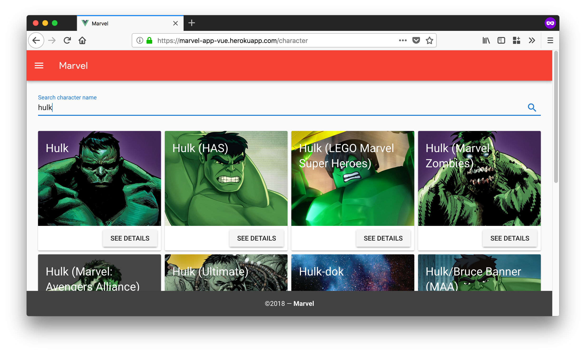

# Marvel App


[](https://snyk.io/test/github/magnobiet/marvel-app:package.json?targetFile=package.json)



## Build Setup

``` bash
# install dependencies
npm install

# serve with hot reload at localhost:8080
npm run serve

# build for production with minification
npm run build

# build for production and view the bundle analyzer report
npm run build --report

# run unit tests
npm run unit

# run e2e tests
npm run e2e

# run all tests
npm test
```

For detailed explanation on how things work, checkout the [guide](http://vuejs-templates.github.io/webpack/) and [docs for vue-loader](http://vuejs.github.io/vue-loader).

## Heroku Deploy

```bash
# Create a Heroku Dyno using Node.js buildpack
heroku apps:create YOUR-HEROKU-DYNO-NAME --buildpack https://github.com/heroku/heroku-buildpack-nodejs

# Add static buildpack as secondary
heroku buildpacks:add https://github.com/heroku/heroku-buildpack-static --index 2

# Set `API_PROXY_ORIGIN` environment variable
heroku config:set API_PROXY_ORIGIN="https://gateway.marvel.com/v1/public/"

# Deploy your application
git push heroku master
```

In your browser navigate to https://YOUR-HEROKU-DYNO-NAME.herokuapp.com/

## Used packages

- [vuejs/vue](https://github.com/vuejs/vue)
- [vuejs/vuex](https://github.com/vuejs/vuex)
- [vuejs/vue-router](https://github.com/vuejs/vue-router)
- [vuejs/vue-cli](https://github.com/vuejs/vue-cli)
- [robinvdvleuten/vuex-persistedstate](https://github.com/robinvdvleuten/vuex-persistedstate)
- [lodash/lodash](https://github.com/lodash/lodash)
- [axios/axios](https://github.com/axios/axios)
- [sindresorhus/query-string](https://github.com/sindresorhus/query-string)
- [vuetifyjs/vuetify](https://github.com/vuetifyjs/vuetify)

## License

This project is licensed under the [MIT License](https://magno.mit-license.org/2018). Copyright © Magno Biét
